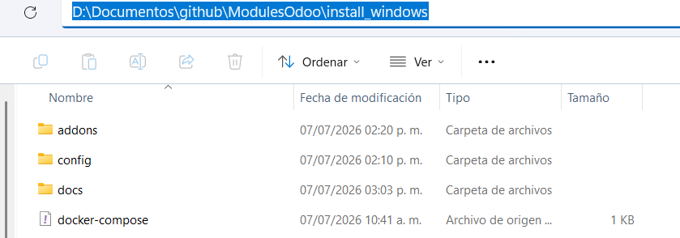
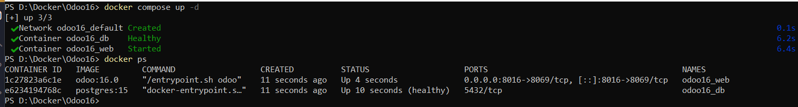
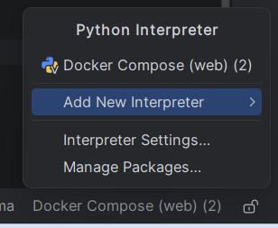
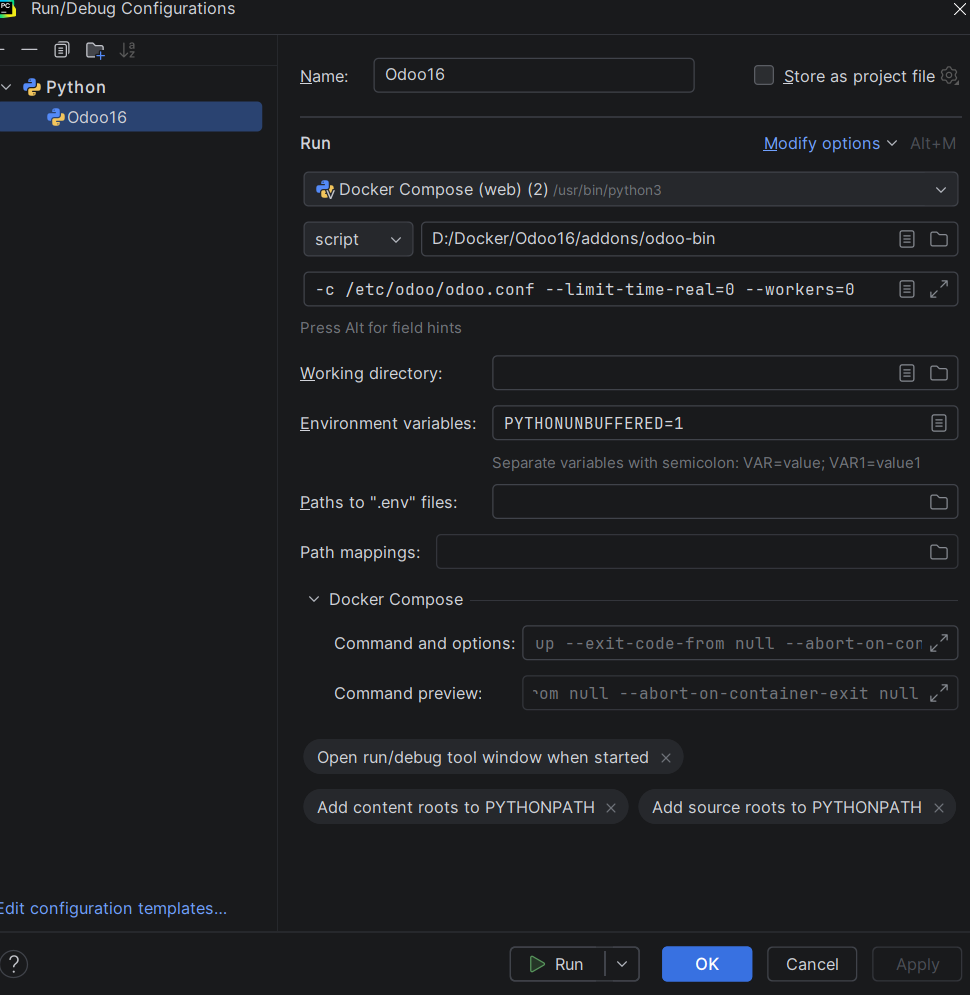
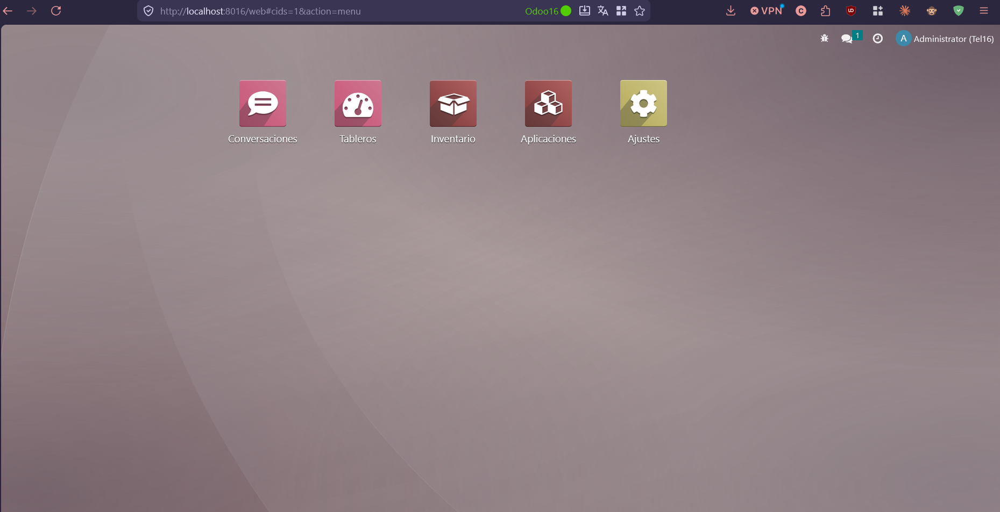

# Odoo 16 + Docker + PyCharm (Windows)

Este proyecto proporciona un entorno de desarrollo para **Odoo 16 Enterprise** utilizando **Docker Compose** en Windows y configurado para trabajar con **PyCharm Professional**, permitiendo ejecutar y depurar el servidor directamente desde el IDE.

---

# Tabla de contenido

- [Requisitos](#requisitos)
- [Estructura del proyecto](#estructura-del-proyecto)
- [Configuración del proyecto](#configuración-del-proyecto)
- [Levantando el entorno](#levantando-el-entorno)
- [Explicación de la estructura](#explicación-de-la-estructura)
- [Configuración de PyCharm](#configuración-de-pycharm)
- [Comandos útiles](#comandos-útiles)
- [Problemas comunes](#problemas-comunes)

---

# Requisitos

Antes de comenzar asegúrate de tener instalado:

- Docker Desktop (última versión)
- PyCharm Professional
- Odoo 16 Enterprise (.exe) (NO INSTALADO, SOLO EL EJECUTABLE)
- 7-Zip (para extraer los módulos Enterprise)

---

# Estructura del proyecto

La estructura recomendada es la siguiente:

```text
Odoo16/
│
├── addons/
│   └── odoo-bin
│
├── config/
│   └── odoo.conf
│
├── enterprise/
│   └── Módulos Enterprise
│
├── docs/
│   ├── estructura-proyecto.png
│   ├── docker-desktop.png
│   ├── pycharm-interpreter.png
│   ├── run-configuration.png
│   └── odoo-running.png
│
└── docker-compose.yml
```
>
>
> 
---

# Configuración del proyecto

## 1. Extraer Odoo Enterprise

El contenido de la carpeta `enterprise/` debe obtenerse del instalador oficial de **Odoo 16 Enterprise (.exe)**.

Puedes utilizar **7-Zip** para extraer el contenido del instalador y copiar todos los módulos dentro de la carpeta:

```text
enterprise/
```

---

## 2. Configurar docker-compose.yml

Este archivo es el encargado de levantar todo el entorno.

Define dos servicios:

### PostgreSQL

- PostgreSQL 15
- Usuario: `odoo`
- Contraseña: `odoo`
- Datos persistentes mediante volumen

### Odoo

Utiliza la imagen oficial:

```text
odoo:16.0
```

Expone el puerto:

```
8016 → 8069
```

Además monta las siguientes carpetas:

| Carpeta local | Carpeta dentro del contenedor |
|---------------|-------------------------------|
| config | /etc/odoo |
| addons | /mnt/extra-addons |
| enterprise | /mnt/enterprise-addons |

---

# Levantando el entorno

Desde la carpeta raíz ejecutar:

```bash
docker compose up -d
```

Verificar que ambos contenedores estén ejecutándose:

```bash
docker ps
```

Abrir Odoo en:

```
http://localhost:8016
```
> 
>
> 

---

# Explicación de la estructura

## config/

Contiene el archivo:

```text
odoo.conf
```

Aquí se configura:

- Base de datos
- Host
- Puerto
- Directorio de datos
- Addons
- Contraseña del administrador

---

## addons/

Aquí deben colocarse todos los módulos desarrollados por el usuario.

Esta carpeta se monta automáticamente como:

```text
/mnt/extra-addons
```

También contiene el archivo:

```text
odoo-bin
```

que sirve para iniciar Odoo desde PyCharm.

---

## enterprise/

Contiene todos los módulos oficiales de Odoo Enterprise.

Esta carpeta se monta como:

```text
/mnt/enterprise-addons
```

No es necesario modificar su estructura.

---

## docker-compose.yml

Es el archivo encargado de levantar:

- PostgreSQL
- Odoo

Además conecta ambos servicios y monta las carpetas necesarias para el desarrollo.

---

# Configuración de PyCharm

## 1. Abrir el proyecto

Abrir la carpeta:

```text
Odoo16/
```

---

## 2. Crear el intérprete

Ir a:

```
Settings
    Project
        Python Interpreter
```

Seleccionar:

```
Add Interpreter
```

Después:

```
On Docker Compose
```

Elegir:

- docker-compose.yml
- Servicio: `web`

PyCharm creará automáticamente el intérprete Docker.

> 
>
> 

---

## 3. Crear la configuración de ejecución

Crear una nueva configuración de tipo:

```
Python
```

Configurar:

**Script**

```
addons/odoo-bin
```

**Parameters**

```text
-c /etc/odoo/odoo.conf --limit-time-real=0 --workers=0
```

**Interpreter**

```
Docker Compose (web)
```

Con esta configuración podrás:

- Ejecutar Odoo
- Colocar breakpoints
- Depurar módulos personalizados

> 
>
> 


---

# Activar Odoo Enterprise

Una vez que Odoo se encuentre en ejecución, aún utilizará la interfaz **Community**, aunque los módulos Enterprise ya estén disponibles dentro de la carpeta `enterprise/`.

Para activar la versión **Enterprise**, sigue estos pasos.

## 1. Ingresar al menú de Aplicaciones

Desde Odoo, ve a:

```
Aplicaciones (Apps)
```

---

## 2. Actualizar la lista de aplicaciones

Haz clic en el menú **Actualizar lista de aplicaciones** (*Update Apps List*).

Esto permitirá que Odoo detecte todos los módulos disponibles, incluyendo los módulos Enterprise ubicados en:

```text
/mnt/enterprise-addons
```

## 3. Buscar el módulo `web_enterprise`

Una vez actualizada la lista de aplicaciones, busca el módulo:

```text
web_enterprise
```

e instálalo.


## 4. Finalizar la instalación

Durante la instalación, Odoo cargará automáticamente los recursos de la carpeta:

```text
enterprise/
```

Al finalizar el proceso, la interfaz cambiará de **Community** a **Enterprise**, habilitando el diseño moderno y todas las funcionalidades correspondientes a la edición Enterprise.

> **Nota:** No es necesario copiar manualmente los módulos ni modificar el archivo `odoo.conf`, siempre que la carpeta `enterprise/` esté correctamente montada en `docker-compose.yml` y configurada en la ruta `addons_path`.


# Resultado

Si todo fue configurado correctamente, Odoo estará disponible en:

```
http://localhost:8016
```

y podrá ejecutarse y depurarse directamente desde PyCharm.

> 
>
> 
---

# Comandos útiles

Levantar el entorno

```bash
docker compose up -d
```

Detener

```bash
docker compose down
```

Reiniciar

```bash
docker compose restart
```

Ver logs

```bash
docker compose logs -f web
```

Reconstruir la imagen

```bash
docker compose up --build
```

---

# Problemas comunes

## El puerto 8016 ya está en uso

Modificar el puerto en `docker-compose.yml`.

---

## No aparecen los módulos personalizados

Verificar que estén dentro de:

```text
addons/
```

y actualizar la lista de aplicaciones desde Odoo.

---

## PostgreSQL tarda en iniciar

Esperar unos segundos antes de ejecutar Odoo. Docker Compose utiliza un **healthcheck** para garantizar que la base de datos esté lista antes de iniciar el servidor.

---

# Licencia

Este proyecto se comparte con fines educativos y de desarrollo.
